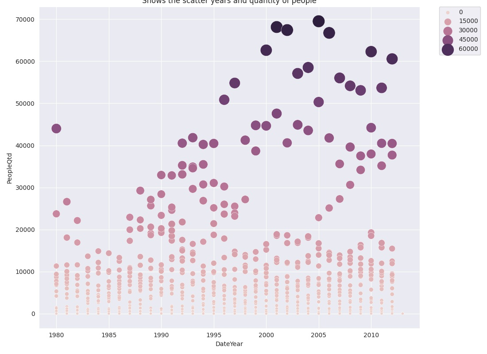

# Python Exploratory Data Analysis

```text
             ####(#############                                                                    ./                                                
             ##/   (############(                                                                  *##                                                
             ###(################                                                         (#(      *##                                                
                       #(########                                                         ###      *##                                                
    ############################# *///////              *(######.      /#(        (#(   ((######   *##  ./(##(*         (#####(.         /(####(#,    
   (############################# *////////          (##       /##*    ##(        (##     ##(      *###/     *###    (##.     .##(    ##(       ###.  
   #############################. *////////          (##        /((,   ##(        (##     ##(      *##        /(#   ((#         ###   ##(        (#*  
   #############*....      .   .///////////          (##        .##(   ##(        (##     ###      *##        *##   ###         (##.  ##(        ##*  
   #########( .////////////////////////////          (##        *###   ##(        (##     ##(      *##        *##   (##         ##(   ##(        ##*  
   ########( */////////////////////////////          (##        #(#    ###        (##     ###      *##        *##    ##(       /(#.   ##(        ##*  
   *#######( /////////////////////////////*          (#####((####,      /#(#(((((####      ###/.   *##        *##     .###/*/(##,     ##(        ##*  
      (####( //////////**///////***/*//*.            (##                          /##                                                                 
             ////////////////////                    (##                          ##/                                                                 
             //////////////   *//                    (##                       *###.                                                                  
             ./////////////, .//,                      *                    /,.                                                                       
                ,************,
```

```text
888~-_                            888                  
888   \    /~~~8e  888-~88e  e88~\888   /~~~8e   d88~\ 
888    |       88b 888  888 d888  888       88b C888   
888   /   e88~-888 888  888 8888  888  e88~-888  Y88b  
888_-~   C888  888 888  888 Y888  888 C888  888   888D 
888       "88_-888 888  888  "88_/888  "88_-888 \_88P
```

International Migration Flows to and from Selected Countries

* Using Jupyter Notebooks

  `AppDan - Canada International Migration Flows.ipynb`

* Creating Data Pipeline

  `Inter-Migr-Flows-Canada.py`

*We can use an App like Apache Airflow to schedule the pipeline chain.*

* Submit the script to generate the html

  `./Inter-Migr-Flows-Canada.py`

* Generate HTML File with many charts

  `Report-Canada.html`

    Graphic 1: Shows the scatter years and quantity of people
    

    Graphic 2: Areas-years vs quantity of people
    

    Graphic 3: Distribution of the number of people by year and Region
    

    Graphic 4: Line Areas-years vs quantity of people
    

    Graphic 5: Map QTD of People 2013
    

    Graphic 6: Heatmap Total by Area
    

    Graphic 7: Heatmap Total by Region
    

Reference Source table: Excel File

| LOAD_DATE | FILE_NAME | USER_NAME | PATH | FILE_DATE | SIZE | HASH_MD5 | HASH_SHA256 |
|---|---|---|---|---|---|---|---|
| 2021 Jan 14 (Thu) 19:34:33 | Canada.xlsx | root | /home/jovyan/spark | 2020 Nov 12 (Thu) 14:48:26 | 217195 | ba18e956238fbd164e3c063d7bf100af | dd2022b503cb434b6a2e72e6576d01d10a45f60cf2ff1fcdd5b34cebef590576  |