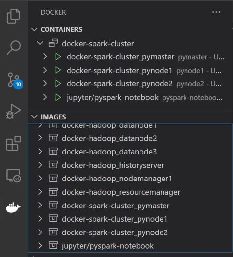

# Spark Cluster

```asc
                        ##         .
                  ## ## ##        ==
               ## ## ## ## ##    ===
           /"""""""""""""""""\___/ ===
      ~~~ {~~ ~~~~ ~~~ ~~~~ ~~~ ~ /  ===- ~~~
           \______ o           __/
             \    \         __/
              \____\_______/
```

## Docker Compose

```asc
docker-compose-spark.yml
```

To create the Spark Cluster with:

* 1 Driver Node

    ```asc
    Dockerfile
    supervisord.conf
    ```

* 2 Worker Node

    ```asc
    Dockerfile
    supervisord.conf
    ```

* 1 App Notebook

    ```asc
    Dockerfile
    ```

Driver Node Web Application


Driver Node Web Application History


Runniong CLuster VS Code


