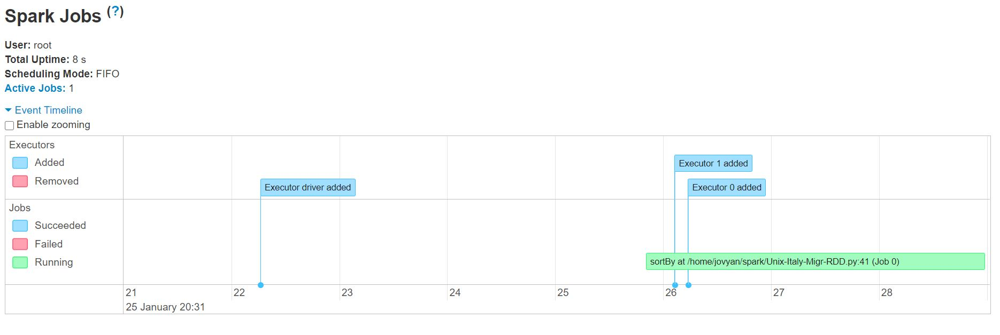
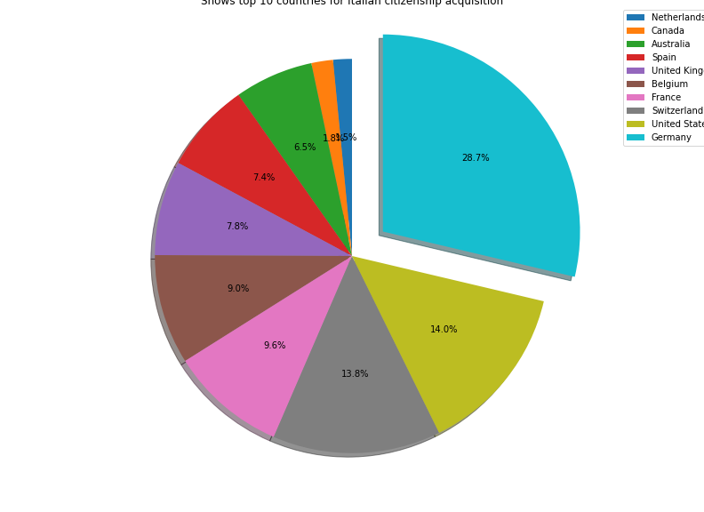

# Pyspark Data Analysis

```asc
                                                                              ////                  
                                                                             ///////                
                                                                            /////////               
                                                                            ////  ///// ////////////
                                                                           ////    //////////////// 
                                                                       ////////             /////   
                                                                ////////////              /////     
                                                               ///////                  ////        
           ,,,,         , ,   ,,,,   , ,  ,,     ,,,,,   ,,,     ///////////             /////      
       ,,,,,,,,,,,     ,  ,   ,    ,,  ,   ,,,   ,  ,   ,,,           /// ,,,             /////     
     ,,,,,    ,,,,                                                      ,,,,,     ,, ///////////    
     ,,,,,              ,,,,,,,,,,           ,,,,,,,,,,         ,,,,,,  ,,,,,   ,,,, ////////////   
     ,,,,,,,         ,,,,,,,,,,,,,,,      ,,,,,,,,,,,,,,,     ,,,,,,,,  ,,,, ,,,,,          ///     
       ,,,,,,,,    ,,,,,        ,,,,,   ,,,,,        ,,,,,   ,,,,      ,,,,,,,,,                    
         ,,,,,,,  ,,,,,          ,,,,, ,,,,,          ,,,,,  ,,,,      ,,,,,,,,,,                   
           ,,,,,, ,,,,           ,,,,  ,,,,,          ,,,,  ,,,,,      ,,,,  ,,,,,                  
 ,,,,,     ,,,,,  ,,,,,,       ,,,,,   ,,,,,,       , ,,,,  ,,,,      ,,,,,    ,,,,,                
 ,,,,,,,,,,,,,,  ,,,,,,,,,,,,,,,,,       ,,,,,,,,,,,  ,,,,  ,,,,      ,,,,,     ,,,,,,              
   ,,,,,,,,,     ,,,,  ,,,,,,,,             ,,,,,,,, ,,,,  ,,,,,      ,,,,        ,,,,,, ,          
                 ,,,,                                                                               
                ,,,,,                                                                               
```

The purpose of this exercise is to try to simulate in an "uncomplicated" way the corporate environment.

## Configure Cluster

 I configure a Standalone Spark Cluster using docker compose, all scripts available.

## Exploratory Data Analysis

* Using Jupyter Notebooks

  `AppDan - Italy International Migration.ipynb`

* Creating Data Pipeline

  `Unix-Italy-Migr-RDD.py`

> We can use an App like Apache Airflow to schedule the pipeline chain.

* Submit the script to be processed by cluster

   ```bash
    ./bin/spark-submit \
       --master spark://172.25.0.101:7077 \
       /home/jovyan/spark/Italy-Migr-RDD.py \
       1000
   ```

* Monitoring the execution

    Web UI Spark Event Timeline
    

    Web UI Spark Jobs
    

* Generate HTML File with a simple pie chart

  `Report-Italy.html`

  Top 10 Italy Citizenship acquisitio

  
